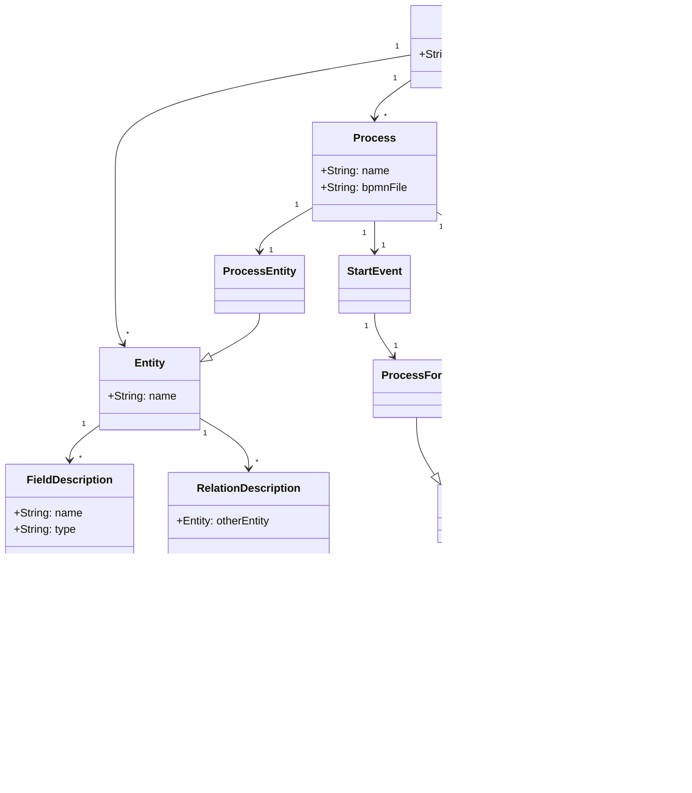

```mermaid
classDiagram
    class PAIS{
        +String: name
    }
    class Entity{
        +String: name
    }
    class FieldDescription{
        +String: name
        +String: type

    }
    class RelationDescription{
        +Entity: otherEntity

    }
    class ServiceDescription{

    }
    class Process{
        +String: name
        +String: bpmnFile
    }
    class ProcessEntity{

    }
    class StartEvent{

    }  
    class UserTask{

    } 
    class Form{

    }
    class InputDescription{
        +FieldDescription: field
        +Boolean: required
        +Boolean: unique
        +Integer: min
        +Integer: max
        +Integer: minLength
        +Integer: maxLength


    }
    class ProcessForm{

    }
    
    PAIS "1" --> "*" Entity
    PAIS "1" --> "*" Process
    PAIS "1" --> "*" Form
    PAIS "1" --> "*" ServiceDescription
    Entity "1" --> "*" FieldDescription
    Entity "1" --> "*" RelationDescription
    Form "1" --> "*" InputDescription
    Process "1" --> "1" ProcessEntity
    Process "1" --> "1" StartEvent
    Process "1" --> "*" UserTask
    ProcessEntity --|> Entity
    ProcessForm --|> Form
    StartEvent "1" --> "1" ProcessForm
    UserTask "1" --|> "1" ProcessForm

```
